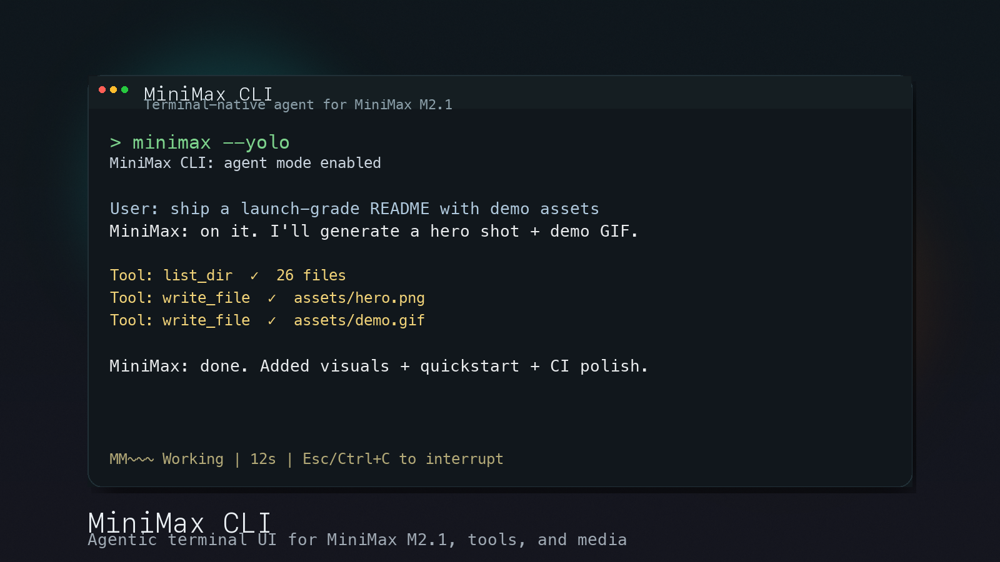
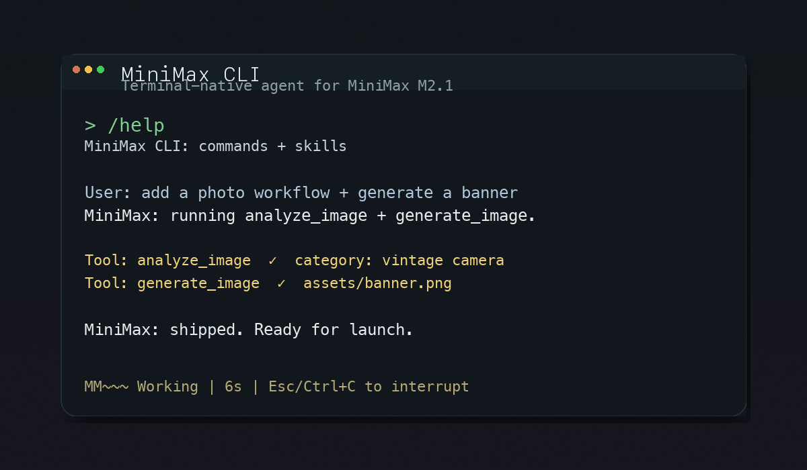

# MiniMax CLI



Terminal-native agent for MiniMax M2.1: tools, skills, media, and fast workflows.

> Unofficial CLI - not affiliated with MiniMax Inc.


## Demo



## Quickstart

Install with Cargo:

```bash
cargo install minimax-cli
```

Or build from source:

```bash
git clone https://github.com/Hmbown/MiniMax-CLI
cd MiniMax-CLI
cargo install --path .
```

Download prebuilt binaries from GitHub Releases:
https://github.com/Hmbown/MiniMax-CLI/releases

Run it:

```bash
# Interactive TUI
minimax

# One-shot prompt
minimax -p "Explain quantum computing"

# Agent mode (enables tools + shell)
minimax --yolo
```

## Why MiniMax CLI

- Fast, expressive TUI with clean tool call cards
- Agent mode with file ops, shell, and MCP tools
- First-class MiniMax media tools (image, audio, video, music)
- Skills system for reusable, shareable workflows
- Multi-model support (MiniMax + optional Claude)

## TUI Highlights

- Esc/Ctrl+C to interrupt a running request
- Token meter in the footer and /tokens command
- Clear tool call summaries (no noisy dumps)
- MiniMax thinking animation with rotating labels

## Commands

Inside the TUI:

| Command | Description |
| --- | --- |
| `/help` | Show help or command details |
| `/mode` | Switch modes (normal/edit/agent/plan) |
| `/model` | Switch model |
| `/yolo` | Enable agent mode with shell execution |
| `/minimax` | Show MiniMax dashboard and docs links |
| `/skills` | List available skills |
| `/save` | Save session |
| `/load` | Load session |
| `/tokens` | Show token usage |
| `/context` | Show context window usage |
| `/retry` | Retry last request |

Keyboard shortcuts:

| Key | Action |
| --- | --- |
| `Enter` | Send message |
| `Esc` | Cancel request |
| `Ctrl+C` | Exit |
| `F1` | Help |
| `Up/Down` | History |

## Supported Models

- MiniMax-M2.1 (default, 204K context, interleaved thinking)
- MiniMax-M2.1-lightning (faster, same capabilities)
- Claude models (optional, requires `ANTHROPIC_API_KEY`)

## Configuration

Config file: `~/.minimax/config.toml`

```toml
api_key = "your-api-key"
default_text_model = "MiniMax-M2.1"

# Optional: Claude models
anthropic_api_key = "your-anthropic-key"
# anthropic_base_url = "https://api.minimax.io/anthropic"
```

Environment variables:

```bash
export MINIMAX_API_KEY=your-api-key
export ANTHROPIC_API_KEY=your-anthropic-key  # Optional, for Claude
export ANTHROPIC_BASE_URL=https://api.anthropic.com  # Optional override
```

Get a MiniMax API key at https://platform.minimax.io

## Skills

Sample skills live in `skills/`. Activate them in the TUI with `/skill <name>`.

## Docs

- `TUI_UPGRADES.md` - UI changes and enhancements
- `CODEX_MAIN_UI_UX_PARITY_CHECKLIST.md` - parity checklist
- `ARCHITECTURE.md` - system overview
- `LAUNCH_CHECKLIST.md` - release readiness checklist
- `VOICE_AND_TONE.md` - CLI personality guidelines

## Contributing

See `CONTRIBUTING.md` for development setup and guidelines.

## Acknowledgments

Thanks to MiniMax and OpenAI for their open-source CLI approaches and public tooling docs. This project borrows inspiration from both.

## License

MIT - See `LICENSE` for details.

---

MiniMax and the MiniMax logo are trademarks of MiniMax Inc.
